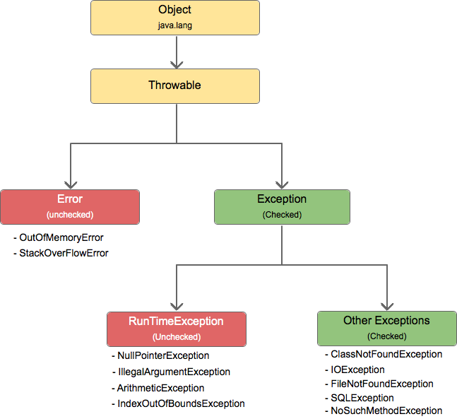

# Diferença entre Erro e Exceção
Erros indicam problemas graves no ambiente ou na JVM, muitas vezes sem solução simples pela aplicação.

Exceções surgem de condições inesperadas durante a execução, mas podem ser tratadas com blocos try-catch ou lançadas com throws.

## Principais Tipos de Exceções

### Checked Exceptions
• Verificadas em tempo de compilação (ex: IOException).  
• Devem ser tratadas ou declaradas na assinatura do método.

### Unchecked Exceptions (Runtime)
• Ocorrem em tempo de execução (ex: NullPointerException).  
• Não exigem tratamento explícito, mas podem ser evitadas com boas práticas.

### Errors
• Não são exceções, mas problemas do ambiente (ex: OutOfMemoryError).  
• Geralmente não há tratamento além de corrigir a causa subjacente.

## Tratamento de Exceções
Use try-catch para capturar exceções específicas e o bloco finally para executar código que sempre deve rodar:
try {
    // código sujeito a exceção
} catch (TipoDeExcecao e) {
    // tratamento ou log
} finally {
    // executado sempre

 

  
}
